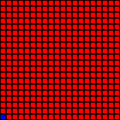
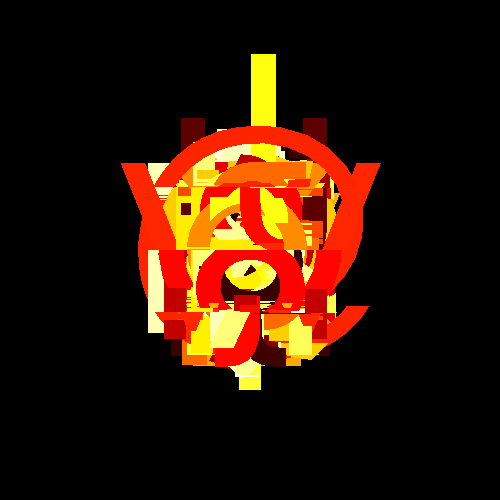
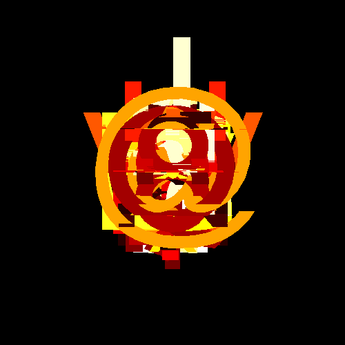
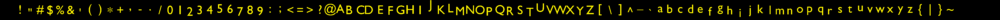

# RayCast Renderer


## DFS/BFS Traversal Visualization

The following animation demonstrates a Depth-First search and a Breadth-first search traversal rendered by this engine:


DFS:

BFS

Greedy

UnifiedCostSearch

A*

## Animation Highlights

These GIFs demonstrate the renderer's ability to animate scenes and generate videos from dynamic geometry and traversal logic, including rotation, scaling, multiple objects, and perspective shifting.

<table>
  <tr>
    <td></td>
    <td></td>
    <td></td>
  </tr>
  <tr>
    <td></td>
    <td></td>
    <td></td>
  </tr>
</table>

# ASCII to 3D Text

The renderer also supports conversion of **ASCII characters into 3D mesh text**. This allows visualization of full strings (e.g., `"HELLO WORLD"`) as 3D geometry.

## Example Outputs

- **Printable ASCII stacked 1 Render**: 
- **Printable ASCII stacked 2 Render**: 
- **Full Printable ASCII Mesh Preview**: 


### Technical Notes

- Converts characters from ASCII 32 to 126 into triangle-based meshes.
- Each mesh is positioned with uniform spacing in the X direction.
- Characters with very few vertices skip decimation to preserve structure.


# RayCast Renderer

[Project Report](Github.pdf)

This project focuses on building a 3D ray-cast renderer from the ground up, adhering to a "make it yourself" philosophy. The goal is to create, optimize, and expand a custom rendering engine, minimizing external inspiration and library usage. The RayCast Renderer itself is a lightweight engine that uses ray tracing to generate high-quality 2D images from 3D scenes. The project implements core concepts like vector mathematics, intersection logic, and parallel processing, while also incorporating advanced optimization techniques such as sub-camera splitting and asynchronous programming.

---


## Key Concepts

### What is Ray Casting?

Ray casting is the process of tracing rays from a viewpoint (camera) into a scene to identify the closest object along each ray's path. This forms the basis for rendering 3D scenes onto a 2D plane.

**Ray Equation**:
R(t) = O + t \* D

- **O**: Ray origin, typically the camera position.
- **D**: Ray direction, represented as a normalized 3D vector.
- **t**: Scalar parameter, determining the point along the ray.

### Triangles as Building Blocks

In this renderer, all objects are represented as collections of **triangles**—the fundamental geometric primitive. Each triangle is defined by:

- **Vertices**: Three points in 3D space (v1, v2, v3).
- **Color**: A color value that determines how the triangle will appear in the final image.

### Intersection Testing

The renderer employs the **linear algebra intersection** to efficiently calculate intersections between rays and triangles. When a ray intersects a triangle, the color of the triangle is assigned to the corresponding pixel in the rendered image.

---

## Features

- **Lightweight Rendering**: Direct computation of ray-object intersections.
- **Custom Scene Setup**: Users can define custom objects, camera settings, and colors for the scene.
- **Optimized Intersection Detection**: Efficiently computes intersections using advanced geometric algorithms.
- **Multiple Output Formats**: Rendered images can be saved in standard formats like PNG or PPM.

---

## Rendering Pipeline

### 1. Scene Setup

Define objects using triangles and configure the camera:

```cpp
// Define a triangle with three vertices
object obj(primitive::cube, scaling, offset, angle, axis);

// Set up the camera
Camera camera(Point(0, 0, -5), Vec3(0, 0, 1), 90.0);
```

### 2. Ray Casting

- Rays are generated for each pixel in the image grid.
- Each ray is cast into the scene to test for intersections with objects.

### 3. Intersection Detection

- The _linear algebra intercection algorithm_ determines:
  - Whether a ray intersects a triangle.
  - The point of intersection.
  - The triangle closest to the ray's origin.

### 4. Color Mapping

- Assign the color of the intersected triangle to the corresponding pixel on the image plane.

### 5. Image Output

- Combine all pixel data to generate the final 2D image.
- Save the rendered image in formats like PNG or PPM.

### Simple Geometries

- Low-resolution and high-resolution renders of basic shapes like cubes.

```cpp
// Render a cube at low resolution
Image image(128, 128);
Renderer renderer(scene, camera);
renderer.render(image);
image.save("low_res_cube.png");
```

### Complex Geometries

- High-detail renders of models like the Dahlia flower and Suzanne.

```cpp
// Load and render a complex model
MeshReader reader;
space scene = space("dahlia.txt");
Image image(1920, 1080);
Camera camera(Point(0, 0, -5), Vec3(0, 0, 1), 90.0);
scene.addCamera(camera);
scene.triggerCameras();
image.save("dahlia_render.png");

```

## Installation

### Dependencies:

1. **[ImageMagick](https://imagemagick.org/script/download.php)**:

   - Required for image format conversion (e.g., PPM to PNG).
   - Ensure it is installed and accessible in the system's PATH.
   - Example usage:
     ```cpp
     std::string convertCommand = "magick convert " + filePath + " " + pngFile;
     ```

2. **C++ Compiler**:
   - Supports C++17 or later (required for multithreading).

## Theory Behind the Renderer

Intersection Testing:
The renderer solves the ray-triangle intersection problem:

1. Check if the ray intersects the plane of the triangle.
2. Confirm the intersection point lies inside the triangle bounds.

Color Mapping:
Each triangle is assigned a unique color. When a ray hits a triangle, the pixel corresponding to the ray is updated with the triangle’s color.

## Limitations

- No Advanced Lighting: No shadows, reflections, or refractions.
- Scene Complexity: Performance drops with many triangles.
- Basic Output: Limited to simple color-based rendering or primitive texture projection.

## Future Implementations

This project is actively being developed, and several exciting features are planned for future releases:

- **Stereoscopic Rendering:** Implementing stereoscopic rendering with proper depth handling to create 3D images.
- **Projection Enhancements:** Expanding projection capabilities beyond the current orthographic projection to include perspective and panoramic projections. This will allow for more realistic and immersive rendering.
- **Polygon Support:** Moving beyond triangle-only support to enable rendering of arbitrary polygons, providing greater flexibility and efficiency.
- **360 Image Capture:** Exploring the possibility of integrating 360-degree image capture functionality.

## License

This project is a personal project for educational purposes.
