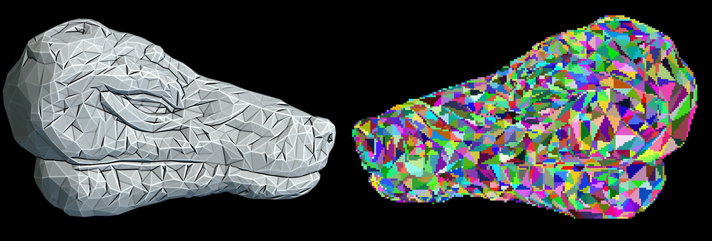

# RayCast Renderer




# Project Overview

[Project Report](Github.pdf)

This project builds a lightweight 3D ray-cast renderer from scratch, following a DIY approach with minimal external libraries. It uses ray tracing to render 2D images from 3D scenes and implements vector math, intersection logic, and parallelism, along with optimizations like sub-camera splitting and async processing.

---

## Key Concepts

### Ray Casting

Ray casting traces rays from the camera into a 3D scene to find the nearest object each ray hits, forming the basis for 2D rendering.

**Ray Equation**:  
`R(t) = O + t × D`  
- **O**: Ray origin (camera)  
- **D**: Normalized direction  
- **t**: Scalar distance  

### Triangles as Primitives

All objects are built from **triangles**, each defined by:
- 3D **vertices** (v1, v2, v3)  
- A **color** value  

### Ray–Triangle Intersection

The engine uses linear algebra to test ray-triangle intersections. When a ray hits a triangle, its color is mapped to the corresponding pixel.

---

## Features

- **Lightweight Rendering**: Direct computation of ray-object intersections.
- **Custom Scene Setup**: Users can define custom objects, camera settings, and colors for the scene.
- **Optimized Intersection Detection**: Efficiently computes intersections using advanced geometric algorithms.
- **Multiple Output Formats**: Rendered images can be saved in standard formats like PNG or PPM.

---

## Rendering Pipeline

### Ray Casting

- Rays are generated for each pixel in the image grid.
- Each ray is cast into the scene to test for intersections with objects.

### Intersection Detection

- The _linear algebra intersection algorithm_ determines:
  - Whether a ray intersects a triangle.
  - The point of intersection.
  - The triangle closest to the ray's origin.

### Color Mapping

- Assign the color of the intersected triangle to the corresponding pixel on the image plane.

### Image Output

- Combine all pixel data to generate the final 2D image.
- Save the rendered image in formats like PNG or PPM.

## Installation

### Dependencies:

1. **[ImageMagick](https://imagemagick.org/script/download.php)**:

   - Required for image format conversion (e.g., PPM to PNG).
   - Ensure it is installed and accessible in the system's PATH.
   - Example usage:
     ```cpp
     std::string convertCommand = "magick convert " + filePath + " " + pngFile;
     ```

2. **C++ Compiler**:
   - Supports C++17 or later (required for multithreading).

## Theory Behind the Renderer

### Intersection Testing

The renderer checks ray-triangle intersections by:

1. Testing if the ray intersects the triangle’s plane.  
2. Verifying the intersection point lies within the triangle.

### Color Mapping

Each triangle has a unique color. When hit by a ray, its color is assigned to the corresponding pixel.

## Search Algorithm Visualizations

### Uninformed Search

| **DFS** | **BFS** | **Uniform Cost** |
|--------|--------|------------------|
|  |  |  |

### Informed Search
**For heuristic-based algorithms, a distance-based heuristic is used.**

| **Greedy** | **Best-First** | **A\*** |
|-----------|----------------|--------|
|  |  |  |


## Animation Highlights

These GIFs demonstrate the renderer's ability to animate scenes and generate videos from dynamic geometry and traversal logic, including rotation, scaling, multiple objects, and perspective shifting.

<table>
  <tr>
    <td></td>
    <td></td>
    <td></td>
  </tr>
  <tr>
    <td></td>
    <td></td>
    <td></td>
  </tr>
</table>

# ASCII to 3D Text

The renderer also supports conversion of **ASCII characters into 3D mesh text**. This allows visualization of full strings (e.g., `"HELLO WORLD"`) as 3D geometry.

## Example Outputs

- **Printable ASCII stacked 1 Render**:  
- **Full Printable ASCII Mesh Preview**: 

### Technical Notes

- Converts characters from ASCII 32 to 126 into triangle-based meshes.
- Each mesh is positioned with uniform spacing in the X direction.
- Characters with very few vertices skip decimation to preserve structure.

## Limitations

- No Advanced Lighting: No shadows, reflections, or refractions.
- Scene Complexity: Performance drops with many triangles.
- Basic Output: Limited to simple color-based rendering or primitive texture projection.

## Future Implementations

This project is actively being developed, and several exciting features are planned for future releases:

- **Stereoscopic Rendering:** Implementing stereoscopic rendering with proper depth handling to create 3D images.
- **Projection Enhancements:** Expanding projection capabilities beyond the current orthographic projection to include perspective and panoramic projections. This will allow for more realistic and immersive rendering.
- **Polygon Support:** Moving beyond triangle-only support to enable rendering of arbitrary polygons, providing greater flexibility and efficiency.
- **360 Image Capture:** Exploring the possibility of integrating 360-degree image capture functionality.

## License

This project is a personal project for educational purposes.
